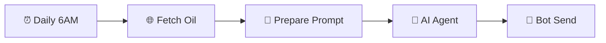
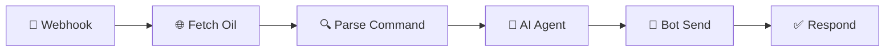
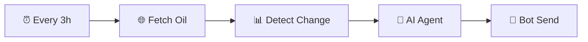

<div align="center">

# ⛽ Discord Oil Bot

### บอทราคาน้ำมันไทยอัจฉริยะบน Discord

ดึงราคาน้ำมันจาก **PTT · Shell · Bangchak** แล้วใช้ AI สรุปให้อ่านง่ายเป็นภาษาไทย

[](https://n8n.io)
[](https://discord.js.org)
[](https://groq.com)

</div>

---

## 📁 โครงสร้างโปรเจค

```
n8n/
├── bot.js                                    # Discord Bot
├── Discord Oil Bot (Groq LLaMA).json.json    # n8n Workflow
├── .env                                      # ค่าลับ (Token, URL)
├── .gitignore                                # กัน .env ไม่ให้ขึ้น Git
├── package.json                              # Dependencies
├── README.md                                 # เอกสารนี้
└── readme.txt                                # เอกสาร (Plain Text)
```

---

## ✨ ฟีเจอร์หลัก

### 📊 รายงานราคาน้ำมันประจำวัน
ทุกเช้า 06:00 น. บอทจะดึงราคาน้ำมัน 8 ชนิดจาก 3 ปั๊ม แล้วให้ AI สรุปเปรียบเทียบพร้อมแนะนำปั๊มที่ถูกที่สุด ส่งเข้า Discord อัตโนมัติ

### 💬 คำสั่งดูราคาน้ำมัน
พิมพ์คำสั่งใน Discord เพื่อดูราคาน้ำมันเฉพาะชนิดที่ต้องการ บอทจะตอบกลับทันที

### 🤖 คุยกับบอทเรื่องน้ำมัน
ถามคำถามเกี่ยวกับน้ำมันได้แบบอิสระ AI จะตอบโดยอ้างอิงข้อมูลราคาจริงล่าสุด (ตอบเฉพาะเรื่องน้ำมันเท่านั้น)

### 🔔 แจ้งเตือนเมื่อราคาเปลี่ยน
ทุก 3 ชั่วโมง ระบบจะเช็คราคา ถ้ามีการเปลี่ยนแปลง จะส่งแจ้งเตือนทันที

---

## 🎮 คำสั่งใน Discord

### คำสั่งดูราคา

| คำสั่ง | น้ำมันที่แสดง |
|:------:|:------------|
| `!all` | ทุกชนิด ทุกปั๊ม |
| `!diesel` | ดีเซล B7 |
| `!b20` | ดีเซล B20 |
| `!d-premium` | ดีเซลพรีเมียม |
| `!95` | แก๊สโซฮอล์ 95 |
| `!91` | แก๊สโซฮอล์ 91 |
| `!e20` | แก๊สโซฮอล์ E20 |
| `!e85` | แก๊สโซฮอล์ E85 |
| `!benzine` | เบนซิน 95 |
| `!compare` | เปรียบเทียบทุกปั๊ม + แนะนำปั๊มถูกสุด |
| `!help` | แสดงรายการคำสั่งทั้งหมด |

### คุยกับบอท

```
!ask ดีเซลแพงขึ้นไหม
!ask ควรเติมน้ำมันตอนไหนดี
!ask ปั๊มไหนถูกที่สุดตอนนี้
@OilBot วันนี้น้ำมันขึ้นหรือลง
```

> **หมายเหตุ:** บอทจะตอบเฉพาะเรื่องน้ำมันเท่านั้น ถ้าถามเรื่องอื่นจะแนะนำให้ถามเรื่องน้ำมันแทน

---

## ⚙️ n8n Workflow

Workflow ชื่อ **Discord Oil Bot (Groq LLaMA)** มี 3 Flow ทำงานแยกกันอิสระ:

### Flow 1 — Daily Report (รายงานประจำวัน)



- **Trigger:** Schedule ทุกวัน 06:00 น.
- **ทำอะไร:** ดึงราคาน้ำมัน → AI สรุปเปรียบเทียบทุกปั๊ม → ส่ง Discord
- **AI Prompt:** สรุปราคาน้ำมัน แนะนำปั๊มถูกสุด น้ำมันขึ้น/ลง ควรเติมไหม

### Flow 2 — User Commands & Chat (คำสั่ง + แชท)



- **Trigger:** Webhook รับข้อมูลจาก bot.js
- **ทำอะไร:** แยกว่าเป็นคำสั่ง (`!diesel`, `!compare` ฯลฯ) หรือแชทอิสระ (`!ask`, `@OilBot`)
- **คำสั่ง:** ดึงเฉพาะน้ำมันที่ user เลือก → AI สรุป → ตอบกลับ channel เดิม
- **แชท:** ดึงข้อมูลน้ำมันทั้งหมดเป็น context → AI ตอบคำถาม → ตอบกลับ channel เดิม
- **Dynamic Channel:** ใช้ `channelId` จาก webhook ตอบกลับ channel ที่ user พิมพ์

### Flow 3 — Price Alert (แจ้งเตือนราคาเปลี่ยน)



- **Trigger:** Schedule ทุก 3 ชั่วโมง
- **ทำอะไร:** เทียบราคากับครั้งก่อน (เก็บใน Static Data) ถ้าเปลี่ยนจะส่งแจ้งเตือน
- **ถ้าราคาไม่เปลี่ยน:** ไม่ส่งอะไร (workflow หยุดทำงานที่ Detect Change)

---

## 🚀 วิธีติดตั้ง

### 1. ติดตั้ง Dependencies

```bash
npm install
```

### 2. สร้างไฟล์ `.env`

สร้างไฟล์ `.env` ในโฟลเดอร์โปรเจค:

```env
BOT_TOKEN=<Discord Bot Token ของคุณ>
N8N_URL=<n8n Webhook URL ของคุณ>
```

- **BOT_TOKEN** — ได้จาก [Discord Developer Portal](https://discord.com/developers/applications) → Bot → Token
- **N8N_URL** — ได้จาก Webhook node ใน n8n เช่น `https://your-n8n.app.n8n.cloud/webhook/discord-bot`

### 3. Import Workflow เข้า n8n

1. เปิด n8n Cloud
2. ไปที่ **Workflows** → **Import from File**
3. เลือกไฟล์ `Discord Oil Bot (Groq LLaMA).json.json`

### 4. ตั้งค่า Credentials ใน n8n

ต้องตั้ง 2 อัน:

**Groq API (สำหรับ AI):**
1. ไปที่ **Credentials** → **Add Credential** → ค้นหา **Groq**
2. ใส่ API Key จาก [console.groq.com](https://console.groq.com)
3. Save แล้วเลือก credential นี้ใน node Groq Model ทั้ง 3 ตัว

**Header Auth (สำหรับ Discord Bot):**
1. ไปที่ **Credentials** → **Add Credential** → ค้นหา **Header Auth**
2. ตั้งค่าดังนี้:
   - **Name:** `Authorization`
   - **Value:** `Bot <Discord Bot Token ของคุณ>`
3. Save แล้วเลือก credential นี้ใน node Bot Send ทั้ง 3 ตัว

### 5. ตั้งค่า Channel ID

node **Bot Send (Daily)** และ **Bot Send (Alert)** ต้องใส่ Channel ID จริงใน URL:

```
https://discord.com/api/v10/channels/<CHANNEL_ID>/messages
```

**วิธีหา Channel ID:**
1. เปิด Discord → Settings → Advanced → เปิด **Developer Mode**
2. คลิกขวาที่ channel ที่ต้องการ → **Copy Channel ID**
3. นำไปแทนที่ `<CHANNEL_ID>` ใน URL ของ node

> **Bot Send (Command)** ไม่ต้องแก้ เพราะใช้ `channelId` จาก webhook อัตโนมัติ

### 6. Activate Workflow

- **ทดสอบ:** ใช้ `webhook-test` URL ใน `.env` ไม่ต้อง activate (n8n จะรอรับเมื่อกด Listen)
- **Production:** เปลี่ยนเป็น `webhook` URL ใน `.env` แล้ว **activate workflow** ใน n8n

### 7. รันบอท

```bash
node bot.js
```

เมื่อเห็นข้อความ `Bot online: ...` แสดงว่าบอทพร้อมใช้งาน ลองพิมพ์ `!help` ใน Discord เพื่อทดสอบ

---

## 🛠 เทคโนโลยีที่ใช้

- **Discord Bot** — discord.js
- **Workflow Automation** — n8n Cloud
- **AI Model** — LLaMA 3.3 70B Versatile (via Groq API)
- **Oil Data** — [Thai Oil API](https://api.chnwt.dev/thai-oil-api/latest)
- **Runtime** — Node.js
- **Secret Management** — dotenv

---

## 📌 หมายเหตุ

- ข้อมูลราคาน้ำมันดึงจาก API ภายนอก อาจมีความล่าช้าเล็กน้อย
- AI อาจสรุปผิดพลาดในบางกรณี ควรตรวจสอบกับแหล่งข้อมูลจริงเสมอ
- Bot Token เป็นข้อมูลลับ ห้ามเผยแพร่ ให้เก็บไว้ในไฟล์ `.env` เท่านั้น
